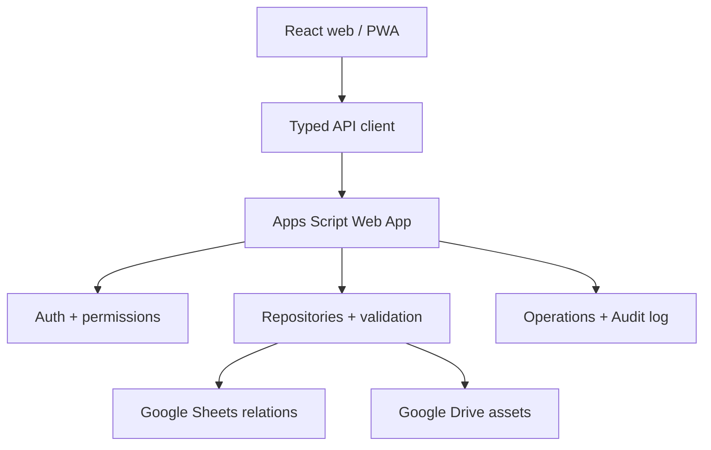
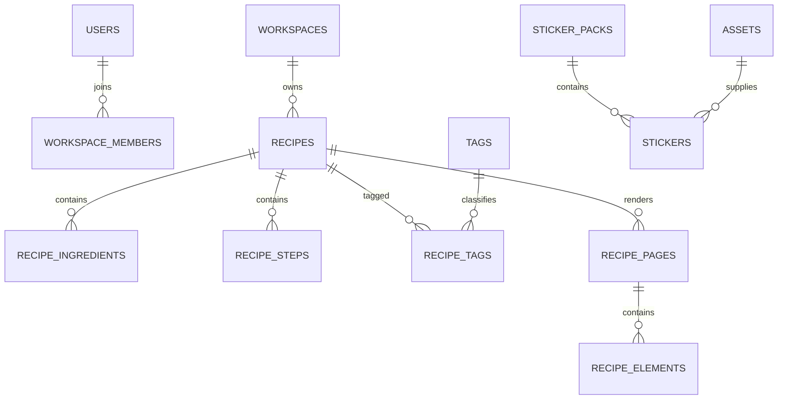

# Электронная книга рецептов — продуктовая и техническая концепция

Статус: архитектурный blueprint для старта репозитория  
Версия документа: 1.1  
Дата: 2 сентября 2026 года

## 1. Решение в одном абзаце

Проект следует строить как адаптивное React-приложение в эстетике электронной тетради: рецепты хранятся как структурированные данные, а их красивое представление — как отдельный редактируемый документ из страниц, текстовых блоков, фотографий, рамок и стикеров. React не обращается к Google Sheets напрямую. Между интерфейсом и данными работает небольшой Google Apps Script API. Google Sheets играет роль реляционной базы, Google Drive хранит фотографии, миниатюры, стикеры, экспорты и снимки версий. Первая версия — веб-приложение и устанавливаемая PWA; возможность добавить мобильную оболочку и приложение для компьютера сохраняется за счет общих контрактов, чистого доменного слоя и адаптеров хранения.

Главная техническая мысль проекта:

> Рецепт, макет, тема и стикеры — четыре независимые сущности. Их можно комбинировать и менять, не уничтожая исходные данные рецепта.

## 2. Оценка проекта

Идея сильная и вполне реалистичная для 5–10 пользователей. Ее ценность не в еще одном списке рецептов, а в сочетании двух режимов:

1. Практичная база: поиск, теги, ингредиенты, шаги, фото, избранное.
2. Творческая тетрадь: страницы, рукописные заголовки, композиция, собственные темы, шаблоны и стикер-паки.

Google Sheets подходит как стартовое хранилище при небольшой аудитории и редких конкурентных записях. Но это не настоящая СУБД: в нем нет внешних ключей, индексов, транзакций и серверной авторизации. Поэтому Apps Script должен эмулировать эти свойства: проверять связи, блокировать конкурентные записи, поддерживать ревизии строк, вести журнал операций и никогда не доверять данным, пришедшим из браузера.

Самая сложная часть — не каталог рецептов, а визуальный редактор. Его нельзя пытаться сделать полностью свободным аналогом Canva в первом релизе. Правильная траектория: сначала структурированный рецепт и шаблоны, затем ограниченный редактор страниц, затем расширенные настройки.

Оценка сложности:

- каталог, авторизация, CRUD и поиск — средняя;
- Google Sheets/Drive API и надежность записей — средняя;
- темы и обычные шаблоны — средняя;
- редактор с перемещением, масштабированием, текстом и undo/redo — высокая;
- надежный импорт/экспорт вместе с файлами — средне-высокая;
- синхронное совместное редактирование — очень высокая и не входит в первую версию.

Ориентир для одного разработчика: 8–12 полноценных рабочих недель до устойчивого MVP или 3–5 месяцев при работе в свободное время. Быстрый прототип можно показать раньше, но его не следует считать готовым хранилищем пользовательских рецептов.

## 3. Продуктовая формула

### 3.1. Что пользователь получает

- личную и общую библиотеку рецептов;
- карточки с названием, отдельным главным фото, описанием, ингредиентами и шагами;
- теги вроде `выпечка`, `перекусы`, `обеды`, а также собственные теги;
- поиск по названию, описанию, ингредиентам и тегам;
- фильтры, сортировку и избранное;
- выбор готового макета;
- редактор страницы с текстом, изображениями и стикерами;
- базовые стикер-паки и создание собственных паков по логике Telegram;
- встроенные темы и конструктор собственных тем;
- экспорт рецепта, книги, темы, шаблона или стикер-пака;
- импорт ранее экспортированных материалов;
- историю сохраненных версий и восстановление;
- адаптивный интерфейс на телефоне и компьютере.

### 3.2. Принципы продукта

1. **Сначала содержание, затем оформление.** Рецепт должен оставаться читаемым даже без дизайнерского макета.
2. **Макет не владеет данными.** Он только показывает поля рецепта через привязанные элементы.
3. **Главное фото — отдельное поле.** Оно не является случайным изображением внутри страницы.
4. **Настраиваемость через безопасные токены.** Пользователь меняет разрешенные параметры, а не вставляет произвольный CSS или HTML.
5. **Любое действие обратимо.** Черновики, мягкое удаление, undo/redo и версии защищают от потери работы.
6. **Простая версия доступна всегда.** Пользователь может создать хороший рецепт без открытия дизайнерского режима.
7. **Малый стек.** Каждая зависимость должна закрывать конкретную трудную задачу.
8. **Хранилище заменяемо.** Интерфейс не знает о строках, листах и Drive ID.

## 4. Интерпретация визуального референса

Референс задает эстетику личной кулинарной тетради и scrapbook:

- теплая бумага вместо стерильного белого фона;
- рукописные или рисованные заголовки;
- мягкие пастельные акценты;
- иллюстрации еды, ленты, рамки, заметки и небольшие стикеры;
- фотографии результата как визуальный центр;
- свободная, но понятная композиция;
- ощущение страницы, которую собирали вручную.

Эту эстетику не стоит переносить на весь служебный интерфейс. Каталог, поиск, настройки и админ-панель должны быть спокойными и очень читаемыми. «Бумажность» и декоративность концентрируются внутри карточки рецепта и превью шаблонов. Так приложение останется удобным, а страницы — выразительными.

### 4.1. Базовое направление стиля

**Характер:** уютный, теплый, личный, аккуратно-рукотворный.  
**Форма:** округлые углы, мягкие тени, тонкие контуры, карточки как листы бумаги.  
**Типографика интерфейса:** нейтральный читаемый гротеск с кириллицей.  
**Типографика страницы:** несколько безопасных рукописных, гротескных и антиквенных гарнитур.  
**Анимация:** короткая и функциональная; никакого постоянного «плавания» декора.  
**Текстуры:** очень слабые, чтобы не мешали тексту и печати.

### 4.2. Начальная палитра приложения

| Токен | Светлая тема | Темная тема | Назначение |
| --- | --- | --- | --- |
| `app.background` | `#F4EFE7` | `#1F1B19` | общий фон |
| `app.surface` | `#FFFDF8` | `#2B2623` | панели и карточки |
| `app.surfaceRaised` | `#FFFFFF` | `#352E2A` | всплывающие элементы |
| `app.text` | `#302A25` | `#F7EFE6` | основной текст |
| `app.textMuted` | `#766C63` | `#BEB1A6` | вторичный текст |
| `app.border` | `#DDD2C5` | `#4B423C` | границы |
| `app.primary` | `#B9576B` | `#E18496` | основные действия |
| `app.primaryText` | `#FFFFFF` | `#26181C` | текст на primary |
| `app.accent` | `#D8A84E` | `#E6BF6D` | выделения |
| `app.success` | `#64845E` | `#8CB584` | успех |
| `app.danger` | `#B64F45` | `#ED8177` | ошибки и удаление |
| `app.focus` | `#376FA3` | `#78B7ED` | видимый focus ring |

### 4.3. Стартовые стили страниц

Это не жесткие темы приложения, а независимые темы полотна:

| Название | Бумага | Чернила | Акцент 1 | Акцент 2 | Характер |
| --- | --- | --- | --- | --- | --- |
| Теплая тетрадь | `#FFF8E8` | `#3A3028` | `#C86F58` | `#D5A74F` | классический уютный лист |
| Клубничный крем | `#FFF0F2` | `#4A3036` | `#D96D86` | `#F0B8A5` | десерты и напитки |
| Медовый крафт | `#F6E6BD` | `#493B25` | `#C28A27` | `#7F9352` | выпечка, осень, крафт |
| Черничные чернила | `#F6F3E9` | `#273753` | `#526DA5` | `#9A79A8` | прохладная тетрадная тема |
| Какао ночью | `#2B211E` | `#F8EBDD` | `#D98C72` | `#D7B36A` | темный уютный стол |
| Полночная ягода | `#211D2B` | `#F4ECFA` | `#C47DB5` | `#7DA7C7` | более фантазийная темная тема |

Темная тема приложения не обязана делать страницу темной: пользователь может работать в темном интерфейсе с кремовым листом.

## 5. Карта экранов

### 5.1. Основные маршруты

| Экран | Назначение |
| --- | --- |
| Вход / приглашение | вход через Google, принятие приглашения, имя профиля |
| Библиотека | сетка и список рецептов, поиск, фильтры, сортировка |
| Просмотр рецепта | готовая страница, структурированный режим, печать и экспорт |
| Новый рецепт | пошаговое создание содержания без дизайнерской сложности |
| Редактор рецепта | содержание, главное фото, теги, ингредиенты, шаги |
| Режим дизайна | страницы, слои, текст, изображения, стикеры, тема |
| Стикер-паки | базовые, свои, импортированные, создание и управление |
| Шаблоны | просмотр, создание копии, редактирование, применение |
| Темы | встроенные темы, конструктор, импорт и экспорт |
| Настройки | профиль, язык, внешний вид, единицы, поведение редактора |
| Администрирование | пользователи, приглашения, роли, состояние БД, журнал |

### 5.2. Библиотека рецептов

Карточка в каталоге показывает только необходимое:

- миниатюру главного фото;
- название;
- до трех тегов;
- автора, если это общая библиотека;
- суммарное время, если заполнено;
- отметку избранного;
- статус черновика.

Полный визуальный макет рецепта не нужно рендерить в каждой карточке каталога: это дорого и визуально шумно. Для каталога используется специально созданная миниатюра.

### 5.3. Два режима редактирования

**Режим «Рецепт»** предназначен для всех пользователей:

- название;
- главное фото;
- короткое описание;
- порции;
- подготовка и приготовление;
- секции ингредиентов;
- упорядоченные шаги;
- теги;
- источник и личные заметки;
- выбор шаблона и темы страницы.

**Режим «Дизайн»** предназначен для композиции:

- добавление и удаление страниц;
- перемещение, изменение размера и поворот элементов;
- порядок слоев;
- привязка к сетке и направляющим;
- блокировка элементов;
- дублирование;
- вставка стикеров, фото, фигур и текста;
- изменение фона и темы конкретной страницы;
- undo/redo;
- масштаб просмотра.

На телефоне режим рецепта должен быть полноценным. Дизайнерский режим на телефоне допускает основные действия, но точная композиция ориентирована на планшет и компьютер.

## 6. Модель рецепта и страницы

### 6.1. Каноническое содержание рецепта

Рецепт хранит смысловые данные независимо от визуального оформления:

- `title` — название;
- `description` — описание;
- `coverAssetId` — главное фото результата;
- `servings` — количество порций, опционально;
- `prepMinutes` и `cookMinutes` — время, опционально;
- `ingredients[]` — структурированный список;
- `steps[]` — упорядоченные шаги;
- `tagIds[]` — связи с тегами;
- `sourceUrl` — источник идеи, опционально;
- `notes` — личные заметки;
- владелец, видимость, статус и ревизия.

Главное фото имеет роль `cover`. Остальные фото могут иметь роли `gallery`, `step` или `decoration`. Это не позволяет случайно заменить обложку декоративной картинкой.

### 6.2. Визуальный документ

У рецепта может быть одна или несколько страниц. Каждая страница имеет фиксированную логическую систему координат, например 1200 × 1600 единиц. На экране она масштабируется целиком, а координаты элементов остаются стабильными.

Поддерживаемые элементы первой версии:

1. `boundText` — значение поля рецепта, например название или описание.
2. `richText` — свободный текст пользователя.
3. `ingredientList` — автоматически сформированный список ингредиентов.
4. `stepList` — автоматически сформированный список шагов.
5. `image` — главное или дополнительное фото.
6. `sticker` — экземпляр стикера из пака.
7. `shape` — безопасная фигура, рамка, фон или разделитель.

Каждый элемент имеет координаты, размеры, поворот, прозрачность, слой, состояние блокировки и ограниченный набор стилей. Связанные элементы читают актуальные данные рецепта; свободные элементы хранят собственное содержимое.

### 6.3. Текстовый редактор

Для текстовых блоков нужны:

- жирный, курсив, подчеркивание и зачеркивание;
- заголовки и обычный текст;
- маркированные и нумерованные списки;
- выравнивание;
- цвет текста и маркер;
- размер шрифта, включая точные значения вроде 20 или 25 px;
- межстрочный интервал;
- межбуквенный интервал в безопасном диапазоне;
- набор разрешенных шрифтов;
- очистка форматирования.

Текст хранится как структурированный JSON редактора, не как необработанный HTML. При показе нельзя использовать пользовательский HTML через `dangerouslySetInnerHTML`. Это одновременно упрощает миграции и закрывает главный путь XSS.

Диапазоны первой версии:

- размер: 8–96 px;
- line-height: 0.9–2.0;
- letter-spacing: −0.05–0.2 em;
- поворот: −180–180°;
- прозрачность: 0–100%.

## 7. Шаблоны рецептов

Шаблон определяет страницы, расположение элементов, привязки к данным и рекомендуемую тему. Он не содержит пользовательский рецепт.

### 7.1. Слоты шаблона

Типовые `bindingKey`:

- `recipe.title`;
- `recipe.description`;
- `recipe.cover`;
- `recipe.ingredients`;
- `recipe.steps`;
- `recipe.servings`;
- `recipe.totalTime`;
- `recipe.tags`;
- `recipe.notes`.

### 7.2. Применение шаблона

Используется модель **copy-on-use**:

1. Пользователь выбирает шаблон.
2. Его страницы и элементы копируются в визуальный документ рецепта.
3. Копия запоминает `sourceTemplateId` и `sourceTemplateVersion`.
4. Последующее изменение шаблона не ломает готовые рецепты.
5. Пользователь может явно выбрать «применить новую версию», увидеть сравнение и подтвердить замену.

Это предсказуемее, чем автоматическое обновление всех старых карточек.

### 7.3. Создание своего шаблона

Пользователь может:

- создать пустой шаблон;
- дублировать встроенный шаблон;
- сохранить дизайн текущего рецепта как шаблон;
- выбрать, какие элементы станут слотами;
- задать обложку-превью, название и описание;
- сделать шаблон личным или доступным рабочему пространству;
- экспортировать его.

Реальные значения рецепта при сохранении шаблона удаляются или заменяются безопасными демонстрационными данными.

## 8. Стикеры по модели Telegram

### 8.1. Пак и стикер

Стикер-пак — самостоятельная коллекция с названием, обложкой, владельцем, порядком элементов, видимостью и версией. Стикер — файл изображения плюс метаданные для поиска.

Поля пака:

- название и slug;
- описание;
- обложка;
- владелец;
- `private` или `workspace`;
- встроенный/пользовательский;
- версия и статус;
- сортировка.

Поля стикера:

- прозрачный PNG или WebP;
- подпись;
- один основной emoji;
- ключевые слова;
- порядок внутри пака;
- автор и лицензия для встроенных материалов;
- статус.

### 8.2. Пользовательский сценарий

1. «Создать стикер-пак».
2. Название, описание и видимость.
3. Пакетная загрузка изображений.
4. Клиентская проверка, обрезка прозрачных краев и создание миниатюр.
5. Назначение emoji и ключевых слов.
6. Перетаскивание для изменения порядка.
7. Выбор обложки.
8. Публикация внутри рабочего пространства.

При вставке на страницу создается не копия файла, а экземпляр со ссылкой на `sticker_id`, координатами, размером, поворотом, прозрачностью и слоем.

### 8.3. Ограничения первой версии

- только статические PNG/WebP;
- рекомендуемый холст до 1024 × 1024 px;
- после оптимизации до 1 МБ на стикер;
- SVG не принимается, пока нет надежного санитайзера;
- GIF и видео-стикеры отложены;
- удаление фона и AI-генерация не входят в MVP.

### 8.4. Базовые паки

Стартовый набор можно разделить на небольшие паки:

- кухонные инструменты;
- выпечка и десерты;
- овощи, фрукты и специи;
- напитки;
- рамки, скотч и бумажные заметки;
- отметки «любимое», «быстро», «остро», «без сахара»;
- сезонные элементы.

У каждого встроенного ассета должна быть зафиксирована лицензия. Нельзя без разрешения переносить изображения из Pinterest в базовый пак.

## 9. Темы и их настройка

Нужно различать:

1. **Тему приложения** — фон, панели, кнопки, контраст и плотность UI.
2. **Тему страницы** — бумага, чернила, линии, декоративные акценты и шрифты рецепта.
3. **Шаблон** — геометрия и расположение элементов.
4. **Стикер-пак** — набор декоративных объектов.

Эти уровни комбинируются независимо.

### 9.1. Дизайн-токены

Компоненты используют семантические токены, а не конкретные цвета:

- `app.background`, `app.surface`, `app.text`, `app.border`;
- `app.primary`, `app.accent`, `app.focus`, `app.danger`;
- `canvas.paper`, `canvas.paperAlt`, `canvas.ink`, `canvas.inkMuted`;
- `canvas.rule`, `canvas.accent1` … `canvas.accent4`;
- `font.ui`, `font.title`, `font.body`, `font.note`;
- `radius.sm`, `radius.md`, `radius.lg`;
- `shadow.card`, `shadow.floating`;
- `motion.fast`, `motion.normal`;
- `texture.paper`, `texture.ruleStyle`, `texture.intensity`.

Tailwind используется поверх CSS custom properties. Пользовательская тема подставляет только валидированные значения переменных. Никаких динамически собранных имен Tailwind-классов и произвольных CSS-правил.

### 9.2. Конструктор темы

Пользователь может:

- дублировать тему;
- менять палитру через color picker и точный HEX/OKLCH ввод;
- выбирать шрифты из разрешенного каталога;
- настраивать радиусы, тени и плотность;
- выбирать бумагу: чистая, линованная, клетка, точки;
- задавать интенсивность текстуры;
- видеть живое превью каталога и страницы;
- проверять контраст;
- сохранять черновик, публиковать, экспортировать и удалять;
- возвращаться к предыдущей версии.

Встроенные темы неизменяемы. Кнопка «Настроить» создает пользовательскую копию.

### 9.3. Ограничения безопасности

- цвета проходят строгий парсер;
- шрифты выбираются по ID из каталога, URL не принимаются;
- числовые значения имеют min/max;
- текстура выбирается из ассетов пользователя или безопасных пресетов;
- значения `url()`, `expression()`, `var()` от пользователя запрещены;
- перед публикацией выполняется проверка контраста текста, focus и кнопок.

## 10. Поиск, фильтры и сортировка

Для 5–10 человек не нужен отдельный поисковый движок. Сервер возвращает легкие сводки рецептов, а поиск и большинство фильтров работают на клиенте.

Поиск учитывает:

- название;
- обычный текст описания;
- названия ингредиентов;
- теги;
- автора;
- пользовательские заметки только владельца.

Фильтры:

- один или несколько тегов с режимом AND/OR;
- мои / общие;
- избранное;
- автор;
- черновики / опубликованные / архив;
- есть главное фото;
- время приготовления;
- дата создания и обновления.

Сортировка:

- недавно обновленные;
- новые;
- по названию;
- по времени приготовления;
- недавно открытые.

Активные фильтры отражаются в URL. Ссылку на выбранный набор фильтров можно сохранить или отправить другому участнику.

`Recipes.search_text` — допустимое денормализованное поле. Оно пересобирается сервером при изменении рецепта или его ингредиентов/тегов и ускоряет поиск. Каноническими источниками остаются связанные таблицы.

## 11. Рекомендуемый стек

### 11.1. Обязательная часть

| Слой | Решение | Зачем |
| --- | --- | --- |
| Язык | TypeScript в strict mode | общие типы и безопасные контракты |
| Web UI | React | выбранная основа интерфейса |
| Сборка | Vite | быстрый SPA build без серверного фреймворка |
| Маршрутизация | React Router в declarative/data mode | страницы, URL фильтров, lazy loading |
| Стили | Tailwind CSS + CSS variables | быстрый UI и динамические темы |
| Серверное состояние | TanStack Query | кэш, повторные запросы, invalidation, optimistic UI |
| Формы | React Hook Form | динамические ингредиенты и шаги без лишних перерендеров |
| Валидация | Zod | единые runtime-схемы на фронте и в Apps Script |
| Rich text | Tiptap, только нужные расширения | безопасный структурированный текст и точные стили |
| Drag/drop | dnd-kit | сортировка и доступные сценарии перетаскивания |
| Иконки | Lucide React | единый легкий набор |
| API | Google Apps Script Web App | авторизация, правила, Sheets и Drive |
| Данные | Google Sheets | реляционные таблицы для малой аудитории |
| Файлы | Google Drive | фото, стикеры, миниатюры, экспорты, версии |
| Apps Script deploy | clasp + esbuild | локальная разработка и воспроизводимый bundle |
| Unit tests | Vitest + Testing Library | домен и компоненты |
| E2E | Playwright | ключевые пользовательские пути |
| CI | GitHub Actions | проверки, сборка и контролируемый deploy |

Версии библиотек фиксируются lockfile. Node фиксируется на актуальном LTS в `.nvmrc` и `engines`; автоматическое обновление major-версий запрещено.

### 11.2. Что сейчас не нужно

- Next.js и SSR: приложение закрытое и не требует SEO;
- Redux: серверное состояние закрывает TanStack Query, состояние редактора — локальный reducer;
- Axios: достаточно стандартного `fetch` и одного API-клиента;
- GraphQL или tRPC: Apps Script проще обслуживать через небольшой RPC/JSON контракт;
- Prisma/ORM: они не работают с Sheets как с реляционной СУБД;
- Nx/Turborepo: npm workspaces достаточно;
- большая UI-библиотека: Tailwind плюс точечные headless-примитивы при необходимости;
- real-time WebSocket: Apps Script для этого не предназначен;
- полнофункциональный Canvas/WebGL-движок: DOM-страница проще для текста, адаптивности и печати;
- AI-функции: не нужны для доказательства основной ценности.

### 11.3. Будущие оболочки

Сначала приложение становится качественной PWA: адаптивность, manifest, установка, кэш оболочки и локальные черновики. Затем при реальной необходимости:

- iOS/Android — Capacitor поверх той же web-сборки;
- Windows/macOS/Linux — Tauri поверх той же web-сборки.

Не нужно добавлять Capacitor или Tauri в репозиторий до появления задачи выпустить соответствующее приложение.

## 12. Архитектура системы



### 12.1. Границы ответственности

**React:** интерфейс, локальное состояние редактора, предварительная обработка изображений, кэш, черновики, визуальный экспорт.  
**Контракты:** типы запросов/ответов, схемы импорта, коды ошибок, DTO.  
**Apps Script:** проверка пользователя и роли, валидация, бизнес-правила, транзакционный порядок действий, доступ к Sheets/Drive, аудит.  
**Sheets:** только строки данных и связи.  
**Drive:** только бинарные/крупные артефакты и снимки версий.

Ни один React-компонент не должен знать название листа, номер колонки или Drive folder ID.

## 13. FSD-структура репозитория и правила чистого кода

Web-приложение организуется по **Feature-Sliced Design (FSD)**. FSD применяется внутри `apps/web/src`, а не ко всему монорепозиторию. Общие платформонезависимые пакеты и Apps Script имеют собственные архитектурные границы.

Это важно: FSD — не просто названия папок. Главная ценность методологии состоит в строгом направлении зависимостей, изоляции бизнес-слайсов и небольших публичных API. Если оставить папки, но разрешить произвольные импорты, архитектура быстро превратится в обычный набор `components`, `hooks` и `utils`.

### 13.1. Общая структура

Рекомендуется легкий монорепозиторий на npm workspaces без Nx или Turborepo:

```text
/
├─ apps/
│  ├─ web/
│  │  └─ src/
│  │     ├─ app/                  # запуск, providers, router, global styles
│  │     ├─ pages/                # страницы, соответствующие маршрутам
│  │     ├─ widgets/              # крупные самостоятельные блоки страниц
│  │     ├─ features/             # пользовательские действия
│  │     ├─ entities/             # бизнес-сущности и их базовое отображение
│  │     └─ shared/               # UI-kit, API foundation, config, generic lib
│  └─ apps-script/
│     └─ src/
│        ├─ entrypoints/          # doGet, doPost, setup, migrations
│        ├─ controllers/          # разбор/валидация API запросов
│        ├─ services/             # сценарии, права и бизнес-операции
│        ├─ repositories/         # реализация таблиц Google Sheets
│        ├─ storage/              # реализация Google Drive
│        └─ platform/             # lock, cache, properties, logging
├─ packages/
│  ├─ contracts/                  # Zod-схемы, DTO и коды ошибок
│  ├─ domain/                     # чистые правила, не зависящие от React/Google
│  └─ design-tokens/              # имена токенов и встроенные темы
├─ docs/
├─ .github/workflows/
├─ package.json
├─ package-lock.json
└─ README.md
```

Слой `processes` не используется: он устарел в актуальной спецификации FSD. Новые нестандартные слои вроде `services`, `store`, `infrastructure` внутри `apps/web/src` также не создаются. Их содержимое распределяется по смыслу между `app`, `features`, `entities` и `shared`.

### 13.2. Закон зависимостей FSD

Разрешенное направление импортов:

```text
app → pages → widgets → features → entities → shared
```

Модуль может импортировать:

- файлы собственного слайса;
- публичные API слайсов, расположенных строго ниже;
- внешние npm-пакеты;
- разрешенные workspace-пакеты `contracts`, `domain`, `design-tokens` согласно правилам ниже.

Модуль не может импортировать:

- слой выше себя;
- другой слайс на том же слое;
- внутренний файл чужого слайса в обход `index.ts`;
- код web-приложения из `packages/*` или Apps Script;
- Apps Script API, `SpreadsheetApp` или Drive ID напрямую из React-кода.

| Откуда | Можно импортировать | Нельзя импортировать |
| --- | --- | --- |
| `app` | все нижние слои | — |
| `pages` | widgets, features, entities, shared | app, другая page |
| `widgets` | features, entities, shared | app, pages, другой widget |
| `features` | entities, shared | app, pages, widgets, другая feature |
| `entities` | shared | app, pages, widgets, features, другая entity |
| `shared` | внешние библиотеки и свои сегменты | любой бизнес-слой |

Связь между двумя entities по умолчанию поднимается в `features` или выше. Редкое неизбежное пересечение допускается через явный `@x` public API, например `entities/recipe/@x/asset`, и обязательно обсуждается на code review.

### 13.3. Назначение слоев именно в этом проекте

#### `app`

Только код, относящийся ко всему приложению:

- entrypoint;
- router;
- QueryClient и глобальные providers;
- Google auth provider;
- error boundaries;
- global styles и подключение тем;
- инициализация PWA;
- app-level feature flags.

`app` соединяет систему, но не реализует рецепт, поиск или редактор.

#### `pages`

Один слайс обычно соответствует экрану:

- `sign-in`;
- `recipe-library`;
- `recipe-details`;
- `recipe-edit`;
- `recipe-design`;
- `sticker-packs`;
- `templates`;
- `themes`;
- `settings`;
- `admin`.

Page отвечает за композицию экрана, route params, loading/error/empty состояния. Одноразовый небольшой блок допустимо оставить внутри page. Не нужно выносить каждый компонент в widget или feature заранее.

#### `widgets`

Только крупные самостоятельные блоки, которые повторно используются или являются независимыми частями сложной страницы:

- `app-header`;
- `recipe-library-toolbar`;
- `recipe-preview-panel`;
- `recipe-editor-workspace`;
- `admin-navigation`.

Если блок используется на одной странице и составляет почти все ее содержимое, он остается в page. Слой widgets не должен становиться новой папкой `components`.

#### `features`

Слайс описывает значимое действие пользователя, а не любой hook или кнопку:

- `auth/sign-in`;
- `recipe/create-recipe`;
- `recipe/edit-content`;
- `recipe/design-card`;
- `recipe/publish-recipe`;
- `recipe/toggle-favorite`;
- `recipe/search-recipes`;
- `asset/upload-image`;
- `template/apply-template`;
- `sticker/manage-sticker-pack`;
- `theme/customize-theme`.

Feature может содержать `ui`, `model`, `api`, `lib`, `config`, но добавляются только реально нужные сегменты. Не нужно создавать feature для каждой однострочной кнопки. Если логика нужна только одной page и не является самостоятельной бизнес-возможностью, она остается в page.

Папки `auth`, `recipe`, `asset`, `template`, `sticker`, `theme` в примерах выше являются только **slice groups**. Они не содержат общего `index.ts`, hooks или helpers. Каждый дочерний слайс остается изолированным; общий код группы либо опускается в подходящую entity/shared-библиотеку, либо поднимается в widget/page.

#### `entities`

Базовые бизнес-понятия:

- `user`;
- `workspace`;
- `recipe`;
- `tag`;
- `asset`;
- `theme`;
- `template`;
- `sticker-pack`.

Entity содержит типы представления, mapper, query factory, небольшие правила и переиспользуемый базовый UI: например `RecipeCard`, `TagChip`, `UserAvatar`. Entity не содержит полноценный сценарий «создать рецепт» или «опубликовать пак» — это features.

#### `shared`

Только код без бизнес-знаний:

```text
shared/
├─ api/                           # transport, envelope, base client
├─ ui/                            # button/, dialog/, text-field/...
├─ lib/
│  ├─ color/                      # парсинг и контраст цветов
│  ├─ date/                       # UTC/format helpers
│  ├─ image/                      # resize, hash, MIME validation
│  └─ text/                       # безопасная generic-нормализация
├─ config/                        # env parsing и feature flags
├─ routes/                        # route builders
├─ i18n/                          # инфраструктура локализации
└─ assets/                        # общие статические файлы
```

В `shared` запрещены папки-свалки `utils`, `helpers`, `common`, `types`, `hooks`, `components`. Каждая библиотека в `shared/lib` имеет узкую область ответственности и короткий README с границами применения.

#### Пример одного вертикального сценария

```text
pages/recipe-edit/
├─ ui/recipe-edit-page.tsx        # собирает экран
└─ index.ts

widgets/recipe-editor-workspace/
├─ ui/recipe-editor-workspace.tsx # крупная композиция формы и preview
├─ model/use-editor-navigation.ts
└─ index.ts

features/recipe/edit-content/
├─ ui/recipe-content-form.tsx     # действие редактирования
├─ model/edit-content.schema.ts
├─ model/use-recipe-autosave.ts
├─ api/update-recipe.ts
└─ index.ts

entities/recipe/
├─ ui/recipe-card.tsx             # базовое представление сущности
├─ model/recipe.types.ts
├─ model/recipe.selectors.ts
├─ api/recipe.queries.ts
├─ api/recipe.mapper.ts
└─ index.ts

shared/
├─ api/recipe-book-client/...
├─ ui/button/...
└─ lib/image/...
```

Поток остается читаемым: page собирает экран, widget объединяет крупные части, feature реализует действие, entity описывает Recipe, shared предоставляет технический фундамент.

### 13.4. Сегменты слайса

Разрешенные базовые сегменты:

- `ui` — компоненты и представление;
- `model` — состояние, схемы, селекторы и бизнес-логика слайса;
- `api` — query/mutation functions и mappers;
- `lib` — внутренние функции только этого слайса;
- `config` — флаги и настройки слайса.

Сегмент создается по назначению кода, а не по его синтаксическому виду. Поэтому `hooks`, `types` и `components` не используются как сегменты верхнего уровня. Hook поиска лежит в `features/recipe/search-recipes/model`, а тип Recipe — в `entities/recipe/model` или общем domain package, а не в глобальной папке `types`.

### 13.5. Public API каждого слайса

Каждый слайс имеет один публичный вход `index.ts`. Код снаружи импортирует только из него:

```ts
// Правильно: внешний потребитель видит контракт слайса.
import { RecipeCard, recipeQueries } from '@/entities/recipe';

// Неправильно: потребитель зависит от внутренней структуры.
import { RecipeCard } from '@/entities/recipe/ui/recipe-card';
```

Правила:

- экспортируются только действительно нужные снаружи объекты;
- `export *` запрещен;
- типы экспортируются явно через `export type`;
- внутри одного слайса используются относительные импорты с полным путем, а не собственный `index.ts`;
- между слайсами используются абсолютные alias-импорты;
- для `shared/ui` нет одного огромного barrel: импорт идет из `@/shared/ui/button`, `@/shared/ui/dialog`;
- public API не должен выполнять код и создавать side effects;
- изменение внутренней структуры слайса не должно требовать массовых правок потребителей.

Архитектурный линтер проверяет deep imports, направление слоев и изоляцию слайсов в CI.

### 13.6. Workspace-пакеты и их границы

FSD описывает web-композицию, а общие пакеты решают переносимость:

#### `packages/contracts`

- request/response DTO;
- Zod-схемы внешних данных;
- error codes;
- import/export schema;
- API version constants.

Пакет не импортирует React, Apps Script или DOM. Он может использоваться web и backend. Изменение контракта требует contract test и правила совместимости.

#### `packages/domain`

- чистые сущности и value objects;
- роли и правила доступа;
- recipe invariants;
- вычисление времени/порций;
- правила тем и макетов;
- функции без I/O и глобального состояния.

Пакет не знает о Zod transport DTO, React, Sheets, Drive, fetch или localStorage. `entities` адаптирует domain для web-представления. Apps Script services используют те же правила.

#### `packages/design-tokens`

- перечень семантических token keys;
- встроенные темы;
- безопасные диапазоны;
- преобразование theme data в проверенные CSS variables.

Пакет не принимает и не генерирует произвольный CSS.

Разрешения на импорт общих пакетов:

| Пакет | Кто может импортировать | Ограничение |
| --- | --- | --- |
| `contracts` | сегменты `api/model`, app bootstrap, Apps Script controllers | сырые DTO не используются как UI model |
| `domain` | entities/features model, Apps Script services | shared и UI-kit не знают бизнес-домен |
| `design-tokens` | app styles, shared theme infrastructure, theme entity/service | только объявленные токены, без произвольного CSS |

Если web-коду нужно представить backend DTO, `api`-сегмент валидирует его и mapper превращает в domain/view model до передачи в UI.

### 13.7. Правила TypeScript

1. Включены `strict`, `noUncheckedIndexedAccess`, `exactOptionalPropertyTypes` и `useUnknownInCatchVariables`.
2. `any` запрещен. На внешней границе используется `unknown`, затем Zod parse/narrowing.
3. `as SomeType` не заменяет проверку входных данных. Type assertion разрешен только после доказанного runtime-инварианта и с пояснением.
4. Non-null assertion `!` считается исключением, а не обычным приемом.
5. Публичные функции и сложные callbacks имеют явный return type.
6. Для состояний используются discriminated unions вместо набора противоречивых boolean-флагов.
7. ID разных сущностей не смешиваются: желательно использовать branded types `RecipeId`, `AssetId`, `UserId`.
8. Перечисления задаются схемой/`as const` и union type; TypeScript `enum` без причины не используется.
9. DTO, domain model и view model — разные типы. Mapper выполняет преобразование явно.
10. Массивы/объекты, которые не должны меняться, объявляются `readonly`.
11. Магические строки, query keys, action names и лимиты собираются в типизированные constants рядом с владельцем.
12. Ошибки представляются единым `AppError`/API error union; нельзя принимать решения по тексту `error.message`.
13. Внешние даты приходят строками ISO, а преобразование выполняется в одном date-модуле.
14. `JSON.parse` напрямую в feature/UI запрещен: используется schema parser.
15. Default export не используется, кроме случаев, которых явно требует инструмент маршрутизации.

### 13.8. Правила React

- компонент отвечает за одну визуальную роль;
- бизнес-действие располагается в feature model, а не в обработчике на 100 строк внутри JSX;
- derived state вычисляется при рендере/через selector, а не синхронизируется `useEffect`;
- server state не копируется в глобальный store или `useState` без причины;
- форма получает отдельный draft и явно reset после успешной загрузки/сохранения;
- `useEffect` используется только для синхронизации с внешней системой;
- в dependency arrays нельзя подавлять предупреждения без письменной причины;
- ключ списка — стабильный ID, никогда не index для редактируемых/сортируемых коллекций;
- `memo`, `useMemo` и `useCallback` добавляются только после измерения или для необходимой стабильности контракта;
- большие editor-компоненты подписываются на узкие selectors, чтобы ввод текста не перерисовывал все полотно;
- UI-компоненты не вызывают `fetch`, `SpreadsheetApp` или localStorage напрямую;
- lazy loading обязателен для route pages, Tiptap, design editor и export tools;
- каждый route имеет loading, empty и error state;
- интерактивные элементы доступны с клавиатуры, имеют видимый focus и корректное accessible name;
- кнопка всегда `button`, ссылка всегда `a/Link`; кликабельный `div` запрещен;
- модальные окна возвращают focus и закрываются по Escape;
- ошибки не проглатываются пустым `catch`.

### 13.9. Состояние и работа с TanStack Query

Для каждого вида состояния один владелец:

| Состояние | Где хранится |
| --- | --- |
| данные API | TanStack Query cache |
| текущая форма рецепта | React Hook Form |
| активная editor-сессия и undo/redo | reducer внутри feature `design-card` |
| фильтры библиотеки | URL search params |
| краткий UI state | локальный `useState` |
| офлайн-черновики | отдельный IndexedDB adapter |
| тема/профиль пользователя | API + Query cache |

Правила Query:

- QueryClient создается только в `app/providers`;
- query keys создаются централизованной factory рядом с entity API;
- запросы принимают `AbortSignal` и отменяются при необходимости;
- response проверяется Zod-схемой до попадания в cache;
- mutation знает точные затрагиваемые keys и не очищает весь cache;
- optimistic update применяется только там, где rollback однозначен;
- autosave имеет debounce, один активный запрос и очередь последнего состояния;
- retry выключается для validation/auth/conflict errors;
- stale/cache time выбирается по типу данных, а не одной глобальной цифрой;
- компоненты не формируют RPC envelope вручную.

### 13.10. Правила API и Apps Script-кода

Apps Script не организуется по FSD. У него простая слоистая архитектура:

```text
entrypoint → controller → service → repository/storage → Google services
```

- `doGet`/`doPost` только принимают событие, вызывают controller и формируют ответ;
- controller валидирует envelope/DTO и переводит ошибки в стабильные error codes;
- service проверяет права и выполняет use case;
- repository единственный знает названия листов, заголовки и row mapping;
- storage единственный знает Drive folder/file IDs;
- domain-функции не вызывают Google API;
- Google service objects не передаются во frontend contracts;
- все записи используют batch operations;
- чтение по одной ячейке в цикле запрещено;
- lock берется как можно позже и освобождается как можно раньше в `finally`;
- request idempotency проверяется до создания сущности;
- логирование проходит через один sanitizer и не пишет credential/медиа;
- время, UUID, cache и Google services инъецируются через небольшие adapters, чтобы services тестировались локально;
- один controller не содержит switch на сотни строк: actions распределяются по тематическим handlers;
- repository не принимает необработанный payload пользователя.

### 13.11. Имена и организация файлов

- папки и файлы — `kebab-case`;
- React export — `PascalCase`;
- функции и переменные — `camelCase`;
- constants — `UPPER_SNAKE_CASE` только для настоящих глобальных констант;
- boolean начинается с `is`, `has`, `can`, `should`;
- обработчик события называется по результату: `handleRecipeSave`, а не `handleClick`;
- hook начинается с `use-` в имени файла и `use` в export;
- схемы: `recipe.schema.ts`;
- query factories: `recipe.queries.ts`;
- mappers: `recipe.mapper.ts`;
- unit test находится рядом: `recipe.mapper.test.ts`;
- E2E — в отдельном `tests/e2e`;
- имя не повторяет весь путь без пользы;
- сокращения допустимы только общеизвестные: API, URL, ID, UI.

### 13.12. Tailwind и CSS

- цвета, размеры, радиусы, тени и шрифты приложения идут через semantic tokens;
- произвольные HEX в feature/page запрещены;
- dynamic class names вида ``bg-${color}-500`` запрещены: Tailwind может не включить их в bundle;
- условные классы собираются одним helper, без вложенных тернарных выражений;
- inline styles допустимы только для действительно динамических координат canvas, transform и проверенных CSS variables;
- повторяемый паттерн интерфейса переносится в `shared/ui`, но одноразовая группа классов остается на месте;
- CSS module/custom CSS используется для сложного canvas/print поведения, которое плохо читается в utility-классах;
- `!important` запрещен без описанной причины;
- selector не зависит от случайной DOM-вложенности другой feature;
- `prefers-reduced-motion`, focus-visible, forced colors и печать учитываются на уровне design system;
- текстуры не ухудшают контраст и отключаются в экономном/печатном режиме.

### 13.13. Правила производительности

Оптимизация начинается с архитектуры и измерений, а не с массового `useMemo`.

Обязательные правила:

1. Каталог получает `RecipeSummary`, а не полный recipe document.
2. Главное изображение и thumbnail имеют отдельные запросы и cache keys.
3. Editor/Tiptap/export libraries находятся в lazy chunks.
4. Большие изображения уменьшаются и перекодируются до upload.
5. Canvas хранит нормализованные элементы и обновляет только измененный element/page.
6. Autosave не сериализует все страницы на каждое нажатие клавиши.
7. Независимые чтения выполняются параллельно, связанные — последовательно.
8. Apps Script делает один batch read и строит Map в памяти вместо повторных sheet calls.
9. Никакой виртуализации списков до измерения; после сотен карточек она добавляется осознанно.
10. Тяжелая операция имеет progress/cancel или выполняется порциями.
11. У изображений заданы размеры, lazy loading и декодирование без layout shift.
12. Рендер-производительность проверяется React Profiler и browser Performance panel.

Начальные бюджеты, контролируемые CI:

- initial route JavaScript — до 250 КБ gzip;
- design-editor chunk — до 450 КБ gzip;
- отсутствие новых chunks больше 200 КБ без объяснения в PR;
- Core Web Vitals для библиотеки: LCP до 2.5 с, INP до 200 мс, CLS до 0.1 на тестовом профиле;
- типовая операция Apps Script укладывается в 2 секунды, кроме media/export;
- один long task в UI не превышает 50 мс без разбиения/worker.

Бюджеты можно пересмотреть по измерениям, но не молча отключить.

### 13.14. Общие правила качества кода

- функция делает одну понятную вещь и имеет предсказуемые side effects;
- side effects находятся на границе, чистые преобразования — в model/domain/lib;
- дублирование удаляется после второго-третьего реального повторения, а не через абстракцию «на будущее»;
- boolean-параметры, сильно меняющие поведение, заменяются отдельными функциями или union options;
- комментарий объясняет **почему**, ограничение или инвариант, а не пересказывает код;
- TODO содержит issue ID и причину; бессрочные TODO запрещены;
- lint rule отключается на минимальной строке с пояснением;
- ошибки пользователя и диагностические детали разделены;
- зависимость добавляется только после проверки лицензии, размера, активности и реальной экономии сложности;
- прямые зависимости объявляются явно, нельзя полагаться на транзитивный пакет;
- lockfile обязателен и меняется вместе с `package.json`;
- публичное поведение изменяется вместе с тестами и документацией;
- миграция схемы добавляется в том же PR, что и код, который ее требует;
- секреты и production IDs не попадают в fixtures, snapshots и логи;
- удаленный код удаляется полностью, а не остается закомментированным;
- преждевременные универсальные engines, plugin systems и generic repositories не создаются.

Размер файла сам по себе не является ошибкой, но служит сигналом. Компонент около 200 строк, hook около 120 строк или функция около 50 строк требуют проверки: осталась ли одна ответственность, можно ли отделить чистую модель или самостоятельный UI-блок. Механически дробить связный код ради числа строк не нужно.

### 13.15. Автоматические архитектурные проверки

В локальных scripts и CI должны работать:

- TypeScript `tsc --noEmit`;
- ESLint с `no-restricted-imports` для направления слоев;
- FSD architectural lint через Steiger или эквивалентное правило;
- запрет deep imports чужих slices;
- запрет циклических зависимостей;
- поиск `any`, `@ts-ignore`, `eslint-disable` без пояснения;
- dependency/license audit;
- bundle size report и budgets;
- unit, contract и E2E smoke tests;
- проверка форматирования без автоматической перезаписи в CI.

Pre-commit hook может запускать форматирование и быстрый lint только для измененных файлов. Полные tests/build остаются в pre-push/CI, чтобы commit не занимал минуты.

### 13.16. Code review checklist

Перед merge автор и reviewer проверяют:

- выбран ли правильный FSD-слой;
- нет ли зависимости вверх или между соседними slices;
- используется ли публичный API;
- не попала ли бизнес-логика в `shared` или page JSX;
- валидируются ли внешние данные;
- проверяются ли права на сервере;
- нет ли лишнего запроса, полной загрузки recipe document или большого изображения;
- обработаны ли loading/empty/error/conflict состояния;
- доступно ли действие с клавиатуры;
- есть ли тест на новое правило и regression;
- не раскрываются ли токены, Drive IDs или личные данные;
- обновлены ли contract/schema/migration/docs;
- нужна ли новая зависимость и как она влияет на bundle;
- можно ли безопасно откатить изменение.

### 13.17. Definition of Done для программной задачи

Задача считается завершенной, если:

1. поведение соответствует acceptance criteria;
2. код расположен в правильном слое и проходит architecture lint;
3. нет TypeScript/lint/format ошибок;
4. новые внешние данные валидируются;
5. есть unit/contract/E2E тест подходящего уровня;
6. проверены mobile и desktop состояния;
7. обработаны ошибка, пустое состояние и ожидание;
8. не ухудшены bundle/performance budgets;
9. миграции и документация добавлены при необходимости;
10. CI полностью зеленый;
11. reviewer может понять публичный API слайса, не читая всю внутреннюю структуру.

На старте этот blueprint можно положить в `docs/PROJECT_BLUEPRINT.md`, а разделить на отдельные `architecture.md`, `code-style.md` и `performance.md` после утверждения правил.

## 14. Пользователи, регистрация и роли

### 14.1. Рекомендуемая модель входа

Для 5–10 человек лучше использовать **Google Sign-In + приглашения**, а не придумывать собственное хранение паролей.

Поток:

1. Администратор создает приглашение на конкретный email и роль.
2. Пользователь входит через Google.
3. Фронтенд получает краткоживущий Google ID token.
4. Apps Script проверяет подпись JWT, `aud`, `iss`, `exp` и `email_verified` общей JWT-библиотекой, а не доверяет декодированному payload.
5. Для постоянного ID используется Google `sub`; email нужен для приглашения и показа.
6. При первом успешном входе приглашение погашается и создается/активируется пользователь.
7. Каждый API-запрос повторно проверяет токен и членство.

Для будущих mobile/desktop клиентов backend хранит список допустимых OAuth `audience` ID. Пароли приложение не принимает и не хранит.

### 14.2. Роли

| Роль | Возможности |
| --- | --- |
| `owner` | все права, перенос владения, системные настройки |
| `admin` | пользователи, приглашения, общие темы/паки/шаблоны, аудит |
| `member` | свои рецепты и общие материалы, публикация в workspace |
| `viewer` | просмотр разрешенных рецептов без изменений |

Роль проверяется на сервере для каждого действия. Скрытая кнопка на фронте не считается защитой.

### 14.3. Видимость объектов

- `private` — владелец и администраторы;
- `workspace` — все активные участники;
- `shared` с конкретными пользователями можно добавить позже через ACL;
- публичный интернет-доступ в MVP отсутствует.

## 15. Как использовать Google Sheets как реляционную базу

### 15.1. Правила хранения

- одна вкладка = одна таблица;
- первая строка = стабильные машинные имена колонок;
- первичные ключи — UUID-строки, не номера строк;
- внешние ключи проверяет Apps Script;
- время хранится в ISO 8601 UTC;
- булевы значения — `TRUE/FALSE`;
- перечисления валидируются по контракту;
- денежные и локализованные строки к проекту не относятся;
- порядок задается числом `position`, а не физическим порядком строк;
- каждая изменяемая сущность имеет `row_revision`, `created_at`, `updated_at`;
- удаление сначала мягкое через `deleted_at`/`status`;
- доступ к столбцам идет по заголовкам, не по захардкоженным индексам;
- чтение и запись выполняются диапазонами, а не по одной ячейке;
- пользователи не получают прямой доступ к Spreadsheet.

### 15.2. Где допустим JSON

Реляционная модель остается основной. JSON разрешен только там, где данные по природе документные или расширяемые:

- структура rich text одного блока;
- ограниченный style объекта;
- метаданные аудита;
- снимок версии, хранящийся отдельным файлом в Drive.

Нельзя хранить весь рецепт, всех пользователей или весь стикер-пак одним JSON blob в ячейке.

### 15.3. Псевдотранзакции

Каждая операция записи:

1. получает `request_id`;
2. проверяет, не была ли она уже выполнена;
3. берет `ScriptLock`;
4. перечитывает затрагиваемые строки;
5. проверяет права, внешние ключи и `expected_revision`;
6. регистрирует операцию как `started`;
7. выполняет пакетные изменения в определенном порядке;
8. пишет аудит;
9. помечает операцию `committed`;
10. освобождает lock в `finally`.

Если ответ потерялся после сохранения, повтор с тем же `request_id` возвращает прежний результат и не создает дубликат.

## 16. Реляционная схема

### 16.1. Карта связей



### 16.2. Вкладки первой очереди

#### `Meta`

| Колонка | Назначение |
| --- | --- |
| `key` | уникальный системный ключ |
| `value` | значение |
| `updated_at` | время изменения |

Ключи: `schema_version`, `api_version`, `data_revision`, `created_at`, `drive_root_folder_id`, `maintenance_mode`.

#### `SchemaMigrations`

| Колонка | Назначение |
| --- | --- |
| `migration_id` | стабильный ID миграции |
| `name` | читаемое имя |
| `checksum` | контрольная сумма |
| `applied_at` | время применения |
| `applied_by` | пользователь/система |
| `status` | `applied` / `failed` |

#### `Users`

| Колонка | Назначение |
| --- | --- |
| `user_id` | внутренний UUID |
| `google_sub` | уникальный стабильный ID Google |
| `email` | текущий email для показа |
| `email_normalized` | поиск приглашения |
| `display_name` | имя |
| `avatar_asset_id` | опциональный FK на Assets |
| `status` | `active`, `disabled`, `pending` |
| `created_at` | создание |
| `last_login_at` | последний вход |
| `row_revision` | оптимистическая блокировка |

#### `Invites`

| Колонка | Назначение |
| --- | --- |
| `invite_id` | UUID |
| `workspace_id` | FK |
| `email_normalized` | приглашенный адрес |
| `role` | выдаваемая роль |
| `invited_by` | FK на Users |
| `expires_at` | срок |
| `used_by` | FK после принятия |
| `used_at` | время принятия |
| `status` | `pending`, `used`, `revoked`, `expired` |

#### `Workspaces`

| Колонка | Назначение |
| --- | --- |
| `workspace_id` | UUID |
| `name` | название общей книги |
| `owner_user_id` | FK на Users |
| `default_app_theme_id` | FK на Themes |
| `default_canvas_theme_id` | FK на Themes |
| `created_at`, `updated_at` | даты |
| `row_revision` | ревизия |

Даже если workspace один, сущность стоит заложить сразу: она недорога и не позволит привязать все записи к одному глобальному пользователю.

#### `WorkspaceMembers`

| Колонка | Назначение |
| --- | --- |
| `workspace_id` | составной FK |
| `user_id` | составной FK |
| `role` | owner/admin/member/viewer |
| `status` | active/disabled |
| `joined_at` | дата |
| `row_revision` | ревизия |

Уникальная пара: `workspace_id + user_id`.

#### `Recipes`

| Колонка | Назначение |
| --- | --- |
| `recipe_id` | UUID |
| `workspace_id` | FK |
| `owner_user_id` | FK |
| `title` | обязательное название |
| `slug` | удобная часть URL, не PK |
| `description_plain` | безопасный текст для поиска и fallback |
| `description_rich_json` | rich text описания |
| `cover_asset_id` | отдельное главное фото |
| `servings` | опционально |
| `prep_minutes` | опционально |
| `cook_minutes` | опционально |
| `source_url` | опционально |
| `notes_rich_json` | личные заметки |
| `visibility` | private/workspace |
| `status` | draft/published/archived/deleted |
| `search_text` | производный нормализованный индекс |
| `source_template_id` | исходный шаблон |
| `source_template_version` | версия при применении |
| `created_at`, `updated_at`, `deleted_at` | даты |
| `row_revision` | ревизия |

#### `RecipeIngredients`

| Колонка | Назначение |
| --- | --- |
| `recipe_ingredient_id` | UUID |
| `recipe_id` | FK |
| `section_title` | например «Крем» |
| `position` | порядок |
| `ingredient_name` | название |
| `quantity_value` | числовое значение, если возможно |
| `quantity_text` | `по вкусу`, `1/2` и т. п. |
| `unit` | г, мл, шт. и т. п. |
| `note` | пояснение |
| `is_optional` | опциональность |
| `created_at`, `updated_at` | даты |
| `row_revision` | ревизия |

#### `RecipeSteps`

| Колонка | Назначение |
| --- | --- |
| `step_id` | UUID |
| `recipe_id` | FK |
| `section_title` | опциональная секция |
| `position` | порядок |
| `body_plain` | fallback и поиск |
| `body_rich_json` | форматированный текст |
| `duration_seconds` | таймер, опционально |
| `asset_id` | фото шага, опционально |
| `created_at`, `updated_at` | даты |
| `row_revision` | ревизия |

#### `Tags`

| Колонка | Назначение |
| --- | --- |
| `tag_id` | UUID |
| `workspace_id` | FK |
| `name` | показываемое имя |
| `normalized_name` | уникальность без регистра |
| `color_token` | безопасный цвет/токен |
| `created_by` | FK |
| `status` | active/archived |
| `created_at`, `updated_at` | даты |
| `row_revision` | ревизия |

#### `RecipeTags`

| Колонка | Назначение |
| --- | --- |
| `recipe_id` | составной FK |
| `tag_id` | составной FK |
| `assigned_by` | FK |
| `assigned_at` | дата |

Уникальная пара: `recipe_id + tag_id`.

#### `Favorites`

| Колонка | Назначение |
| --- | --- |
| `user_id` | составной FK |
| `recipe_id` | составной FK |
| `created_at` | дата |

#### `Assets`

| Колонка | Назначение |
| --- | --- |
| `asset_id` | UUID, используемый приложением |
| `workspace_id` | FK |
| `owner_user_id` | FK |
| `drive_file_id` | оригинал/оптимизированный файл |
| `thumbnail_drive_file_id` | миниатюра |
| `kind` | recipe_image/sticker/avatar/texture/export/snapshot |
| `mime_type` | фактический MIME |
| `width`, `height` | размеры |
| `byte_size` | размер |
| `sha256` | дедупликация и целостность |
| `original_filename` | очищенное имя |
| `access_mode` | private/workspace |
| `status` | pending/ready/deleted/broken |
| `created_at`, `deleted_at` | даты |
| `row_revision` | ревизия |

#### `RecipeAssets`

| Колонка | Назначение |
| --- | --- |
| `recipe_id` | FK |
| `asset_id` | FK |
| `role` | cover/gallery/step/decoration |
| `position` | порядок |
| `created_at` | дата |

`Recipes.cover_asset_id` остается явным быстрым указателем, а `RecipeAssets` описывает все связи.

### 16.3. Вкладки визуального редактора

#### `RecipePages`

| Колонка | Назначение |
| --- | --- |
| `page_id` | UUID |
| `recipe_id` | FK |
| `position` | порядок страницы |
| `width_units`, `height_units` | логический размер |
| `canvas_theme_id` | тема страницы |
| `background_asset_id` | опциональная текстура |
| `background_color` | разрешенный цвет |
| `created_at`, `updated_at` | даты |
| `row_revision` | ревизия |

#### `RecipeElements`

| Колонка | Назначение |
| --- | --- |
| `element_id` | UUID |
| `page_id` | FK |
| `element_type` | boundText/richText/image/sticker/shape/list |
| `binding_key` | привязка к данным рецепта |
| `asset_id` | изображение, если применимо |
| `sticker_id` | стикер, если применимо |
| `content_json` | локальное структурированное содержимое |
| `style_json` | только валидированные свойства |
| `x_units`, `y_units` | позиция |
| `width_units`, `height_units` | размер |
| `rotation_deg` | поворот |
| `z_index` | слой |
| `opacity` | 0–1 |
| `is_locked` | блокировка |
| `created_at`, `updated_at` | даты |
| `row_revision` | ревизия |

### 16.4. Вкладки тем, шаблонов и стикеров

#### `Themes`

`theme_id`, `workspace_id`, `owner_user_id`, `name`, `theme_kind`, `base_mode`, `is_builtin`, `visibility`, `version`, `status`, `preview_asset_id`, `created_at`, `updated_at`, `row_revision`.

#### `ThemeTokens`

`theme_id`, `token_key`, `token_value`, `updated_at`, `row_revision`.  
Уникальная пара: `theme_id + token_key`.

#### `Templates`

`template_id`, `workspace_id`, `owner_user_id`, `name`, `description`, `page_preset`, `recommended_theme_id`, `preview_asset_id`, `is_builtin`, `visibility`, `version`, `status`, `created_at`, `updated_at`, `row_revision`.

#### `TemplatePages`

Аналог `RecipePages`, но с `template_id`.

#### `TemplateElements`

Аналог `RecipeElements`, но без пользовательских данных; связанные элементы содержат `binding_key`.

#### `StickerPacks`

`pack_id`, `workspace_id`, `owner_user_id`, `name`, `slug`, `description`, `cover_sticker_id`, `is_builtin`, `visibility`, `version`, `status`, `created_at`, `updated_at`, `row_revision`.

#### `Stickers`

`sticker_id`, `pack_id`, `asset_id`, `label`, `emoji`, `keywords_normalized`, `position`, `license_code`, `author_credit`, `status`, `created_at`, `updated_at`, `row_revision`.

### 16.5. Системные вкладки

#### `UserSettings`

`user_id`, `setting_key`, `setting_value_json`, `updated_at`, `row_revision`.

Хранить только серверно-синхронизируемые настройки. Временное состояние панелей и последний zoom остаются локальными.

#### `Operations`

`request_id`, `user_id`, `action`, `entity_type`, `entity_id`, `payload_hash`, `status`, `result_json`, `error_code`, `started_at`, `completed_at`.

#### `AuditLog`

`event_id`, `request_id`, `workspace_id`, `user_id`, `entity_type`, `entity_id`, `action`, `before_hash`, `after_hash`, `metadata_json`, `created_at`.

Аудит append-only. Токены, Base64 изображений и полный rich text туда не записываются.

#### `RecipeVersions`

`version_id`, `recipe_id`, `version_number`, `snapshot_asset_id`, `created_by`, `summary`, `created_at`.

Снимок хранится JSON-файлом в Drive; текущие данные остаются реляционными.

## 17. Хранение изображений в Google Drive

### 17.1. Почему не в Google Sheets

Base64 увеличивает файл примерно на треть, делает строки огромными, замедляет чтение всей таблицы, усложняет резервное копирование и легко упирается в ограничения ячеек/запросов. Поэтому Sheets хранит только метаданные и `drive_file_id`.

### 17.2. Структура папок

```text
RecipeBookData/
├─ assets/
│  ├─ recipes/YYYY/MM/<asset-id>/image.webp
│  ├─ recipes/YYYY/MM/<asset-id>/thumb.webp
│  ├─ stickers/<pack-id>/<asset-id>.webp
│  ├─ avatars/<asset-id>.webp
│  └─ textures/<asset-id>.webp
├─ snapshots/<recipe-id>/<version>.json
├─ exports/<user-id>/...
├─ backups/YYYY-MM-DD/...
└─ trash/...
```

Физическая структура вторична; приложение всегда работает через `asset_id`.

### 17.3. Поток загрузки фото

1. Пользователь выбирает файл.
2. Браузер проверяет сигнатуру/MIME, размер и декодируемость.
3. Изображение поворачивается с учетом EXIF и повторно кодируется, удаляя GPS/EXIF.
4. Создается рабочий WebP/JPEG, максимум 2048–2560 px по длинной стороне.
5. Создается миниатюра около 480 px.
6. Вычисляется SHA-256.
7. API создает `Assets` со статусом `pending`.
8. Файлы передаются небольшими контролируемыми payload; Apps Script создает файлы в Drive.
9. После проверки IDs строка становится `ready`.
10. Рецепт связывается с `asset_id`.

Рекомендуемый предел после оптимизации: 2–3 МБ для главного изображения и до 500 КБ для большинства декоративных файлов. Оригинал хранится только по явной настройке, иначе сохраняется оптимизированная версия.

### 17.4. Приватная выдача

По умолчанию Drive-файлы не становятся `anyone with link`. API возвращает разрешенному пользователю миниатюру/изображение в контролируемом ответе, а браузер кэширует его в Cache Storage/IndexedDB. Для каталога всегда загружаются миниатюры, полный файл — только при открытии рецепта.

Если производительность окажется недостаточной, можно отдельно включить режим ссылок «доступ по ссылке», но только после осознанного решения: такие URL нельзя считать приватными.

### 17.5. Удаление и очистка

- удаление рецепта не удаляет файл немедленно;
- asset получает `deleted`, если на него больше нет активных ссылок;
- файл перемещается в `trash`;
- администратор может восстановить его в течение 30 дней;
- еженедельная задача удаляет просроченные файлы;
- очистка всегда сначала строит отчет, затем удаляет конкретный список ID.

## 18. API Apps Script

### 18.1. Формат

Один `doPost` принимает JSON-RPC-подобный envelope:

```json
{
  "apiVersion": 1,
  "requestId": "uuid",
  "action": "recipes.update",
  "credential": "google-id-token",
  "payload": {},
  "expectedRevision": 12
}
```

Успех:

```json
{
  "ok": true,
  "requestId": "uuid",
  "data": {},
  "meta": {
    "apiVersion": 1,
    "schemaVersion": 1,
    "dataRevision": 148
  }
}
```

Ошибка:

```json
{
  "ok": false,
  "requestId": "uuid",
  "error": {
    "code": "REVISION_CONFLICT",
    "message": "Recipe changed on another device",
    "details": {}
  }
}
```

`doGet` используется только для `health`, версии и безопасных диагностических данных. Токены никогда не передаются в query string.

### 18.2. Группы действий

**Bootstrap и auth**

- `auth.bootstrap`;
- `auth.acceptInvite`;
- `profile.update`.

**Recipes**

- `recipes.list` — только сводки;
- `recipes.get` — полный рецепт и визуальный документ;
- `recipes.create`;
- `recipes.updateContent`;
- `recipes.updateDocument`;
- `recipes.publish`;
- `recipes.archive`;
- `recipes.restore`;
- `recipes.delete`;
- `recipes.createVersion`;
- `recipes.restoreVersion`.

**Справочники**

- `tags.list`, `tags.upsert`, `tags.archive`;
- `themes.list`, `themes.create`, `themes.update`, `themes.delete`;
- `templates.list`, `templates.create`, `templates.update`, `templates.delete`;
- `stickerPacks.list`, `stickerPacks.create`, `stickerPacks.update`, `stickerPacks.delete`;
- `stickers.add`, `stickers.update`, `stickers.remove`, `stickers.reorder`.

**Assets**

- `assets.prepareUpload`;
- `assets.upload` или `assets.uploadChunk` после технического spike;
- `assets.finalizeUpload`;
- `assets.get`;
- `assets.delete`.

**Admin**

- `admin.users.list`, `admin.users.updateRole`, `admin.users.disable`;
- `admin.invites.create`, `admin.invites.revoke`;
- `admin.health`, `admin.audit.list`;
- `admin.backup.create`, `admin.orphans.preview`, `admin.orphans.clean`.

### 18.3. Коды ошибок

Минимальный стабильный набор:

- `UNAUTHENTICATED`;
- `INVITE_REQUIRED`;
- `FORBIDDEN`;
- `VALIDATION_FAILED`;
- `NOT_FOUND`;
- `REVISION_CONFLICT`;
- `DUPLICATE_ENTITY`;
- `UPLOAD_TOO_LARGE`;
- `UNSUPPORTED_MEDIA_TYPE`;
- `QUOTA_EXCEEDED`;
- `RATE_LIMITED`;
- `MAINTENANCE_MODE`;
- `INTERNAL_ERROR`.

UI переводит коды в понятные сообщения, но сохраняет `requestId` для диагностики.

## 19. Синхронизация, autosave и конфликты

### 19.1. Ревизии

Каждая изменяемая строка имеет `row_revision`. Обновление передает ожидаемую ревизию. Если сервер видит другое значение, он возвращает `REVISION_CONFLICT`, а не перезаписывает чужую работу.

### 19.2. Autosave

- локальный editor state обновляется немедленно;
- undo/redo работает локально как command stack;
- черновик пишется в IndexedDB каждые несколько секунд;
- серверное сохранение выполняется после 1.5–2 секунд покоя и при уходе с поля;
- визуальный документ отправляется диффом или измененными страницами, не всем рецептом;
- интерфейс показывает `Сохраняется…`, `Сохранено`, `Есть конфликт`, `Офлайн`;
- при закрытии вкладки с несохраненными изменениями появляется предупреждение.

### 19.3. Конфликт

Для MVP не выполняется автоматическое сложное слияние. Пользователь получает:

- серверную версию;
- локальную версию;
- простое сравнение измененных секций;
- выбор «оставить мою копию», «принять серверную» или «создать дубликат».

Это честнее и безопаснее, чем молча делать last-write-wins.

### 19.4. Offline

Первая PWA-версия поддерживает:

- запуск уже загруженной оболочки;
- чтение недавно открытых рецептов;
- локальный черновик текущего рецепта;
- очередь изменений с явным статусом.

Полное многопользовательское offline-слияние не входит в MVP. Перед отправкой очереди все равно проверяется ревизия.

## 20. Импорт и экспорт

### 20.1. Общий принцип

Все форматы имеют:

- `schemaVersion`;
- `type`;
- `id` и стабильные внутренние ссылки;
- `exportedAt`;
- `appVersion`;
- manifest файлов;
- SHA-256 для каждого бинарного файла;
- режим конфликта: skip / duplicate / replace-owned;
- предварительный preview до записи.

Импорт никогда не записывает данные сразу: сначала parse → validate → preview → confirm → commit.

### 20.2. Форматы

| Формат | Содержимое |
| --- | --- |
| `.recipe.json` | один рецепт без бинарных файлов или со ссылками |
| `.recipe.zip` | рецепт, страницы и все разрешенные assets |
| `.recipebook.zip` | набор рецептов и связей |
| `.stickerpack.zip` | manifest пака и изображения |
| `.recipe-theme.json` | токены темы без произвольного CSS |
| `.recipe-template.zip` | страницы шаблона и его assets |
| PDF | визуальный экспорт/печать, не для обратного импорта |
| PNG/WebP | изображение страницы, не для обратного импорта |

### 20.3. Структура ZIP

```text
manifest.json
data.json
assets/
  <asset-id>.webp
  <asset-id>.png
```

Manifest содержит размер, MIME и checksum. Пути нормализуются; `../`, абсолютные пути и неожиданные исполняемые файлы отклоняются.

### 20.4. Импорт текста и внешних источников

Вторая очередь может принять:

- вставленный обычный текст или Markdown;
- JSON-LD `Recipe` со страницы, если пользователь вставил URL;
- ручной перенос идеи из Pinterest с сохранением source URL.

Автоматический scraper Pinterest не должен быть частью MVP: он хрупкий, зависит от правил сервиса и создает вопросы авторских прав. Пользовательские фото и тексты загружаются под ответственность пользователя; приложение сохраняет источник.

### 20.5. Визуальный экспорт

Первая реализация PDF использует печатный CSS и браузерную печать. Для PNG/WebP страница рендерится из того же DOM, но эта функция добавляется после стабилизации редактора. Перед экспортом проверяются загрузка шрифтов и изображений, размеры страниц и переполнение текста.

## 21. Безопасность

### 21.1. Обязательные меры

- таблица и Drive-папка принадлежат отдельному техническому/владельческому Google-аккаунту;
- обычным пользователям они напрямую не расшариваются;
- Apps Script выполняется от имени владельца и сам проверяет каждого пользователя;
- доступ только по приглашениям;
- JWT проверяется по подписи, audience, issuer и expiration;
- Google `sub` — идентификатор, email не является PK;
- все payload проходят Zod-валидацию на сервере;
- права проверяются до чтения и до записи;
- rich text хранится как JSON и безопасно рендерится;
- пользовательские SVG/HTML/CSS запрещены;
- MIME проверяется по содержимому и допустимому списку;
- размеры файлов и запросов ограничены;
- Drive IDs никогда не считаются доказательством права доступа;
- секреты находятся в Script Properties/GitHub Environments, не в репозитории;
- API URL и OAuth client ID не считаются секретами;
- журнал не содержит credential, Base64 и личных заметок;
- rate limit ставится по user ID и действию;
- операции администратора попадают в AuditLog;
- Content Security Policy максимально ограничивает script/img/connect источники.

### 21.2. Ограничение выбранной платформы

Apps Script Web App не дает полноценной инфраструктуры обычного backend и удобных HttpOnly session cookies для отдельно размещенного SPA. Поэтому архитектура использует краткоживущий Google ID token как bearer credential и не хранит собственные пароли. До написания всего приложения нужно сделать отдельный auth/CORS spike на реальном домене размещения.

### 21.3. Угрозы, которые нужно тестировать

- чтение чужого private-рецепта через подмену ID;
- изменение чужого рецепта;
- повтор одного request;
- устаревшая ревизия;
- formula injection в Sheets (`=`, `+`, `-`, `@` в начале пользовательской строки);
- XSS через rich text, filename, theme token и импорт;
- ZIP path traversal;
- файл с ложным расширением;
- слишком большое изображение/decompression bomb;
- ссылка на чужой Drive ID;
- отключенный пользователь с еще действующим ID token.

Перед записью строк, начинающихся с формульных символов, репозиторий должен принудительно задавать текстовый формат или экранировать их.

## 22. Производительность и ограничения Apps Script

Apps Script ограничивает одно выполнение шестью минутами, имеет дневные квоты и лимиты параллельных запусков. Для 5–10 пользователей этого достаточно, если:

- запросы короткие и узкие;
- список рецептов не возвращает страницы и полные изображения;
- диапазоны читаются одним вызовом;
- записи группируются;
- справочники кэшируются;
- изображения оптимизируются до отправки;
- миниатюры загружаются лениво;
- Tiptap и дизайнерский редактор идут отдельным lazy chunk;
- поиск выполняется по сводкам;
- `LockService` удерживается только на время критической записи;
- backup/cleanup запускаются вне активного использования;
- квоты и ошибки видны в admin health.

### 22.1. Целевые показатели MVP

- первый интерактивный экран на обычном соединении: до 2.5 с;
- открытие уже кэшированной библиотеки: до 1 с;
- API list без медиа: до 1.5 с при типовой базе;
- сохранение обычного рецепта: до 2 с;
- визуальная реакция редактора: 60 fps при типовой странице;
- до 100 элементов на странице как мягкий предел;
- до 10 страниц на рецепт как мягкий предел;
- понятное предупреждение до достижения лимита, а не ошибка после него.

## 23. CI/CD

### 23.1. Ветки и окружения

- `main` — готовое состояние;
- feature branches + pull request;
- отдельные staging Spreadsheet, Drive folder и Apps Script deployment;
- production имеет собственные ресурсы;
- production backend deploy — только через GitHub Environment approval;
- web может деплоиться автоматически после успешного CI в `main`.

### 23.2. Workflow `ci.yml`

Запускается на PR и push:

1. checkout;
2. установка зафиксированной Node/npm версии;
3. `npm ci`;
4. проверка форматирования;
5. ESLint;
6. FSD architecture lint и проверка запрещенных deep imports;
7. проверка циклических зависимостей;
8. TypeScript typecheck всех workspaces;
9. unit tests с coverage;
10. contract/schema tests;
11. сборка web и проверка bundle budgets;
12. сборка Apps Script bundle;
13. проверка, что bundle не содержит Node-only API и секретов;
14. Playwright smoke с mock API;
15. загрузка test/build artifacts при ошибке.

### 23.3. Workflow `deploy-web.yml`

- только после зеленого CI на `main`;
- build с production API URL;
- публикация статической сборки в GitHub Pages;
- smoke: открыть приложение, проверить asset paths и health API;
- при неуспехе deployment помечается failed, backend не меняется.

### 23.4. Workflow `deploy-apps-script.yml`

- ручной `workflow_dispatch` или защищенный release tag;
- повтор всех проверок;
- build Apps Script;
- `clasp push` в staging;
- live integration smoke со staging spreadsheet;
- ручное подтверждение production;
- создание неизменяемой Apps Script version;
- обновление существующего deployment на новую version;
- вызов `health` и проверка `apiVersion/schemaVersion`;
- запись номера deployment/version в release notes.

Нельзя делать production `clasp push` на каждый commit без версии и approval.

### 23.5. Защита репозитория

- PR обязателен для `main`;
- обязательные checks: lint, typecheck, unit, contracts, builds, smoke;
- запрет merge при устаревшей ветке;
- Dependabot/Renovate только с отдельными PR;
- major updates вручную;
- secret scanning;
- CODEOWNERS для `contracts`, `apps-script`, migrations и workflows.

## 24. Стратегия тестирования

### 24.1. Unit

- нормализация названий и тегов;
- расчет общего времени;
- права ролей и видимость;
- theme token validation;
- преобразование координат/масштаба;
- сериализация rich text;
- импорт manifests и checksums;
- optimistic revision rules;
- генерация search text;
- вычисление orphan assets.

### 24.2. Contract

- каждый action имеет request/response Zod schema;
- frontend fixture проходит backend schema;
- backend response проходит frontend schema;
- старые export fixtures продолжают импортироваться;
- неизвестные поля обрабатываются согласно version policy;
- enum и error codes синхронны.

### 24.3. Apps Script integration

- репозитории тестируются через in-memory sheet adapter;
- отдельный набор smoke работает на staging Spreadsheet;
- тестируются batch updates, lock, idempotency и partial failure;
- тестовый cleanup удаляет только ресурсы с префиксом запуска.

### 24.4. E2E

Критические сценарии:

1. приглашенный пользователь входит;
2. создает рецепт с главным фото;
3. добавляет ингредиенты, шаги и теги;
4. применяет шаблон;
5. меняет размер текста на 25 px;
6. вставляет и поворачивает стикер;
7. сохраняет и повторно открывает;
8. находит рецепт через ингредиент и фильтр;
9. экспортирует и импортирует копию;
10. получает понятный конфликт при параллельной правке;
11. viewer не может выполнить write;
12. disabled user теряет доступ.

### 24.5. Visual regression

Снимки обязательны для:

- встроенных шаблонов;
- светлой и темной темы UI;
- всех размеров страницы;
- переполнения длинного названия;
- длинного списка ингредиентов;
- мобильной, планшетной и desktop ширины;
- print preview.

## 25. Резервные копии, аудит и диагностика

### 25.1. Backup

- ежедневная копия Spreadsheet или экспорт таблиц;
- еженедельный manifest всех Drive assets с checksum;
- хранение 30 ежедневных и 12 ежемесячных точек;
- ручной полный `.recipebook.zip` экспорт администратора;
- квартальная тестовая процедура восстановления;
- backup считается готовым только после проверки manifest.

### 25.2. Health

`health` сообщает без чувствительных данных:

- API version;
- schema version;
- deployment version;
- время сборки;
- maintenance mode;
- доступность Spreadsheet и Drive;
- приблизительное количество сущностей;
- последнюю успешную backup date;
- последние агрегированные ошибки;
- quota warning flags.

### 25.3. Admin-панель

Минимум:

- пользователи и роли;
- активные приглашения;
- блокировка/активация пользователя;
- состояние backend;
- schema/deployment version;
- последние AuditLog события;
- ошибки и request ID;
- просмотр orphan assets без удаления;
- запуск backup;
- maintenance mode.

## 26. Roadmap

### Этап 0. Технический spike — 2–4 дня

Цель: доказать самые рискованные части до разработки UI.

- создать тестовый Spreadsheet и Drive folder;
- развернуть минимальный Apps Script `health`/echo;
- проверить запрос React → Apps Script с реального домена;
- проверить Google Sign-In и server-side JWT verification;
- проверить приглашение и `sub`;
- загрузить оптимизированное фото в Drive;
- получить приватную миниатюру через API;
- выполнить две конкурентные записи с `LockService`;
- измерить задержки и максимальный практический payload;
- зафиксировать решение по upload: один файл или chunks.

**Gate:** если auth, CORS или приватная выдача изображений не работают устойчиво, архитектура пересматривается до продолжения.

### Этап 1. Основа репозитория и CI — 3–5 дней

- npm workspaces;
- React/Vite/Tailwind;
- Apps Script build и clasp;
- `packages/contracts`, `domain`, `design-tokens`;
- FSD-слои, public API и path aliases;
- ESLint, architecture lint, formatter, strict TypeScript;
- Vitest, Playwright smoke;
- bundle budgets;
- CI workflow;
- staging/prod configuration;
- ADR и документация.

**Gate:** чистый clone → `npm ci` → tests/build без ручных правок.

### Этап 2. Схема, миграции и пользователи — 1 неделя

- setup script создает листы и заголовки;
- schema migrations и Meta;
- Users, Invites, Workspaces, Members;
- Google auth;
- RBAC;
- API envelope, errors, idempotency;
- AuditLog и health;
- базовая admin-панель.

**Gate:** owner приглашает member/viewer; server запрещает чужие действия.

### Этап 3. Библиотека и структурированный рецепт — 1–2 недели

- Recipes, Ingredients, Steps, Tags, Favorites;
- create/edit/view/archive/restore;
- главное фото и миниатюра;
- grid/list;
- поиск, фильтры, URL state;
- autosave и локальный черновик;
- responsive mobile UI.

**Gate:** пользователь полностью ведет рецепты без режима дизайна.

### Этап 4. Визуальная страница и шаблоны — 2–3 недели

- RecipePages/Elements;
- логический canvas и zoom;
- связанные поля;
- text/image/shape/list элементы;
- Tiptap formatting;
- перемещение, resize, rotate, layers, lock;
- undo/redo;
- 3–4 встроенных шаблона;
- overflow warnings;
- print CSS.

**Gate:** после сохранения и повторного открытия композиция совпадает; длинные данные не исчезают молча.

### Этап 5. Стикеры и темы — 1–2 недели

- базовые паки;
- собственный pack CRUD;
- массовая загрузка, порядок, emoji, keywords;
- picker и вставка экземпляра;
- UI и canvas themes;
- конструктор токенов;
- контраст и preview;
- создание копии встроенной темы.

**Gate:** пользователь создает пак и тему, применяет их, а чужой private pack не виден.

### Этап 6. Импорт, экспорт, версии и hardening — 1–2 недели

- versioned recipe/theme/template/sticker formats;
- preview и conflict policy;
- ZIP с checksums;
- PDF/print, затем PNG;
- RecipeVersions;
- backup и restore drill;
- security tests;
- quota/error UX;
- performance profiling;
- accessibility audit.

**Gate:** экспортированный рецепт можно удалить, импортировать и получить эквивалентные данные и assets.

### Этап 7. PWA и релиз MVP — 3–5 дней

- manifest/icons;
- install flow;
- cache оболочки и недавних рецептов;
- offline draft indicator;
- обновление service worker без потери черновика;
- production deploy checklist;
- onboarding и короткая справка.

**Gate:** приложение удобно на телефоне и компьютере, устанавливается и корректно переживает обновление.

### После MVP

Приоритет определяется реальным использованием:

1. улучшенный touch editor;
2. общие ACL на конкретных пользователей;
3. импорт Schema.org Recipe из URL;
4. масштабирование ингредиентов по порциям;
5. список покупок;
6. Capacitor mobile shell;
7. Tauri desktop shell;
8. миграция backend на настоящую БД, если Sheets становится узким местом;
9. только затем — совместное редактирование в реальном времени или AI.

## 27. Критерии MVP

MVP готов, когда:

- 5–10 приглашенных пользователей стабильно входят;
- роли проверяются сервером;
- пользователь создает, изменяет, архивирует и восстанавливает рецепт;
- главное фото отделено от декоративных изображений;
- ингредиенты, шаги и теги реляционны;
- поиск и фильтры работают без полной загрузки медиа;
- есть минимум четыре качественных шаблона;
- текст меняет размер, цвет, выделение и выравнивание;
- стикеры вставляются из базового и собственного пака;
- пользователь создает безопасную кастомную тему;
- autosave не теряет данные и обнаруживает конфликт;
- есть импорт/экспорт рецепта и стикер-пака;
- есть backup, audit и health;
- CI блокирует сломанный build/contract;
- интерфейс проходит клавиатурный сценарий и базовый WCAG-контраст;
- приложение работает на актуальных Chrome, Edge, Firefox и Safari;
- данные можно выгрузить без привязки к приложению.

## 28. Главные риски и решения

| Риск | Вероятность/влияние | Решение |
| --- | --- | --- |
| Apps Script CORS/auth ведут себя иначе в production | среднее/высокое | обязательный этап 0 на реальном origin |
| Sheets медленно сканирует много строк | среднее/среднее | batch reads, summaries, cache, archive, метрики |
| Частичные записи в несколько листов | среднее/высокое | lock, Operations journal, idempotency, repair |
| Потеря правок при двух устройствах | среднее/высокое | expected revision и явный conflict UI |
| Изображения раздувают трафик | высокое/среднее | client resize, WebP, thumbnails, lazy load, cache |
| Редактор превращается в бесконечную Canva | высокое/высокое | фиксированный набор элементов и поэтапный scope |
| Пользовательская тема ломает UI/XSS | среднее/высокое | только token values, allowlists и validation |
| Удаление пака ломает старые рецепты | среднее/среднее | soft delete; использованный asset сохраняется |
| Drive-файл удален вручную | среднее/среднее | health/orphan checker и статус `broken` |
| Квоты владельца | низкое при 5–10/высокое | метрики, короткие запросы, graceful error, путь миграции |
| Авторские права на Pinterest-ассеты | среднее/среднее | source attribution, пользовательская ответственность, лицензии built-ins |

## 29. Путь миграции с Google Sheets

С самого начала вводятся интерфейсы:

- `RecipeRepository`;
- `UserRepository`;
- `ThemeRepository`;
- `StickerRepository`;
- `AssetStorage`;
- `AuthVerifier`;
- `AuditSink`.

Apps Script реализует их через Sheets/Drive. Контракты API не включают номера строк и имена листов. Поэтому будущий перенос возможен по слоям:

1. PostgreSQL/Supabase заменяет Sheets;
2. S3/R2/Supabase Storage заменяет Drive;
3. Node/edge API заменяет Apps Script;
4. React, мобильная и desktop оболочки продолжают использовать те же DTO;
5. export/import формат остается страховкой от vendor lock-in.

Сигналы для миграции:

- активных пользователей существенно больше 20–30;
- тысячи конкурентных записей в день;
- list/save регулярно выходит за целевые задержки;
- квоты влияют на обычную работу;
- требуется real-time collaboration;
- требуются сложные ACL или полнотекстовый поиск;
- восстановление целостности занимает заметное ручное время.

## 30. Решения, которые рекомендуется утвердить сразу

1. Приложение закрытое, вход только по Google-приглашению.
2. Один workspace в UI, но workspace-модель есть в данных.
3. Google Sheets хранит отношения, Google Drive — файлы.
4. Apps Script — обязательный тонкий backend, прямого доступа фронта к Sheets нет.
5. Главное фото — отдельная явная связь.
6. Рецепт и его визуальный документ разделены.
7. Шаблон применяется copy-on-use.
8. Темы состоят из валидируемых токенов, произвольного CSS нет.
9. В MVP только статические PNG/WebP стикеры.
10. Конфликты не затираются last-write-wins.
11. PWA создается раньше native shells.
12. Production Apps Script deploy имеет версию и ручное подтверждение.
13. Импорт/экспорт версионируется с первого релиза.
14. Этап 0 обязателен до большой разработки.

## 31. Первые задачи в backlog

### Epic A — Foundation

- создать workspaces и TypeScript configs;
- подключить contracts/domain/design tokens;
- настроить Vite/Tailwind/router/query;
- собрать Apps Script через esbuild;
- создать mock API;
- поднять CI.

### Epic B — Platform spike

- web app echo;
- auth JWT verification;
- invite proof;
- private image upload/fetch;
- concurrency test;
- задокументировать результаты в ADR.

### Epic C — Data layer

- schema declaration;
- setup/migrations;
- header-based sheet repository;
- foreign key validation;
- lock/operations/audit;
- backup/health.

### Epic D — Recipe core

- Recipe aggregate;
- ingredients/steps/tags;
- cover upload;
- CRUD pages;
- autosave/revisions;
- library/search/filter.

### Epic E — Creative system

- page renderer;
- template binding;
- rich text;
- transform controls;
- stickers;
- themes;
- visual export.

## 32. Официальные технические ориентиры

- [Google Apps Script Web Apps](https://developers.google.com/apps-script/guides/web)
- [Google Apps Script quotas and limits](https://developers.google.com/apps-script/guides/services/quotas)
- [Google LockService](https://developers.google.com/apps-script/reference/lock/lock-service)
- [Google DriveApp](https://developers.google.com/apps-script/reference/drive/drive-app)
- [Server-side verification of Google ID tokens](https://developers.google.com/identity/gsi/web/guides/verify-google-id-token)
- [clasp and GitHub Actions](https://developers.google.com/apps-script/guides/clasp)
- [Feature-Sliced Design: layers and import rule](https://feature-sliced.design/docs/reference/layers)
- [Feature-Sliced Design: slices and segments](https://feature-sliced.design/docs/reference/slices-segments)
- [Feature-Sliced Design: public API](https://feature-sliced.design/docs/reference/public-api)
- [React](https://react.dev/reference/react)
- [Vite](https://vite.dev/guide/)
- [Tailwind theme variables](https://tailwindcss.com/docs/theme)
- [TanStack Query](https://tanstack.com/query/latest/docs/framework/react/overview)
- [Zod](https://zod.dev/)
- [Tiptap](https://tiptap.dev/docs/editor/getting-started/overview)
- [dnd kit](https://dndkit.com/)
- [Vitest](https://vitest.dev/guide/)
- [Playwright](https://playwright.dev/docs/intro)
- [Progressive Web Apps](https://web.dev/learn/pwa/)
- [Capacitor](https://capacitorjs.com/docs)
- [Tauri](https://v2.tauri.app/start/)

## 33. Итоговая рекомендация

Проект стоит реализовывать. Выбранный стек достаточен и не перегружен, если не пытаться сразу добавить все будущие возможности. Главный порядок такой:

1. доказать Apps Script auth/upload/concurrency;
2. построить надежную структурированную книгу рецептов;
3. добавить ограниченный, но качественный редактор страниц;
4. поверх него — стикер-паки, темы и шаблоны;
5. затем экспорт, PWA и оболочки приложений.

При таком разделении Google Sheets не проникнет в интерфейс, рецепт не будет зависеть от одного макета, а пользовательская настраиваемость не превратится в произвольный и небезопасный код. Это дает хороший MVP для небольшой компании и оставляет реальный путь к мобильному приложению, desktop-клиенту и нормальной базе данных позже.
